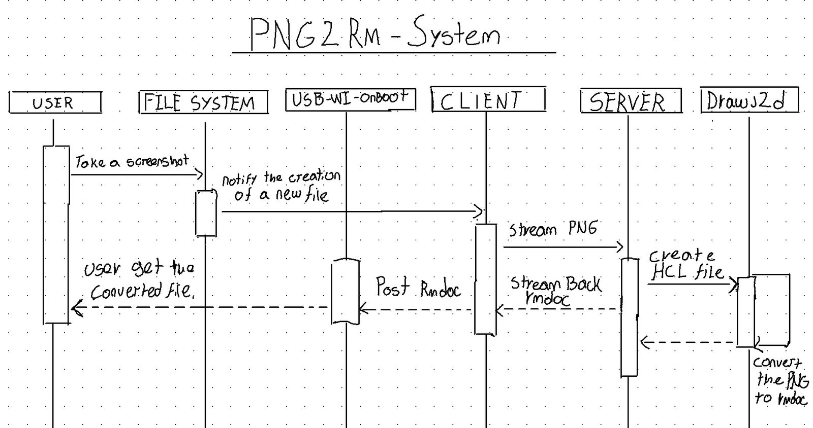

# PNG2RM CONVERSION SYSTEM

[](https://remarkable.com/store/remarkable)
[](https://remarkable.com/store/remarkable-2)
[](https://discord.gg/ATqQGfu)
[](https://discord.gg/bgVXW2bchN)


⚠️ Project under development ⚠️

## Overview
The System is implemented using Go and leverages gRPC for communication. It provides a server that can receive PNG files in chunks, save them, convert them using an external tool (drawj2d), and stream the resulting Remarkable document back to the client.

### Special Acknowledgment to:
>*This wouldn't have been possible without your help and incredible developments.*

> [](https://github.com/Eeems)
> [](https://sourceforge.net/u/qwert2003/profile/)
> [](https://github.com/rM-self-serve)
> [](https://github.com/mb1986)
> [](https://github.com/atngames)

--- 

### How it works:



### Preview
<video width="320" height="240" controls>
  <source src="doc/de8466ca-0f8a-41e8-8f0f-f15885063855.mp4" type="video/mp4">
</video>


## Requirements:
- Golang: https://go.dev/dl
- Protoc: https://grpc.io/docs/protoc-installation/
### Server side:
- Protoc: https://grpc.io/docs/protoc-installation
- Drawj2d: https://sourceforge.net/projects/drawj2d/

### Client side (tablet):
- rm-hacks (enables screenshot feature): https://github.com/mb1986/rm-hacks

- webinterface-onboot: https://github.com/rM-self-serve/webinterface-onboot 


## How to setup (locally):
### Server:
1. **Install Go and necessary dependencies**:
   - Ensure you have Go installed on your system. You can download and install it from [golang.org](https://golang.org/).
   - Set up your development environment to work with Go. Configure `$GOPATH` and add `$GOPATH/bin` to your `$PATH`.

2. **Create the `server-config.yaml` file**:
   - This file should contain the necessary configuration for the server. Create a file named `server-config.yaml` in the same directory as the `main.go` file with the following content:

     ```yaml
     image_folder: "/path/to/image/folder"
     run_path: "/path/to/run/path"
     server_address: "localhost:4040"
     ```

   - Adjust the values of `image_folder`, `run_path`, and `server_address` according to your needs.


---

### Client (tablet):
1. **Transfrer the client binary and the config yaml file to the remarkable**:
   - After transfering the files you have to edit the config file with nano acording to your server config
   you can find the ip address of the server by running `ifconfig` or `ipconfig` 
   
   then:
   ```bash
   $remarkable: ~/ ./client &
   ```

---

⚠️ Please be sure to have rm-hacks and webinterface-onboot Installed⚠️

Now you should be able to convert your screenshots to rmlines in less than 4 sec


---

# Knowloadge base:
- The Wizzard: 
- https://www.youtube.com/playlist?list=PLy_6D98if3UJd5hxWNfAqKMr15HZqFnqf

- https://blog.stackademic.com/go-concurrency-visually-explained-select-statement-b546596c8e6b

- https://blog.stackademic.com/go-concurrency-visually-explained-channel-c6f88070aafa

- https://blog.stackademic.com/go-concurrency-visually-explained-select-statement-b546596c8e6bs